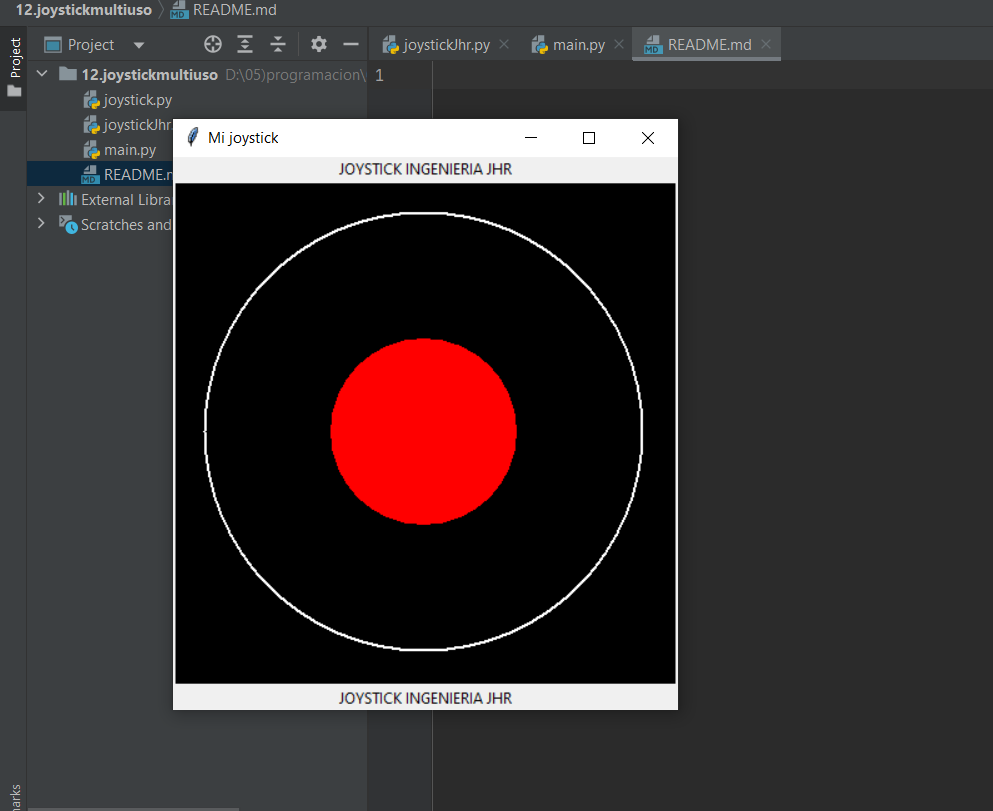
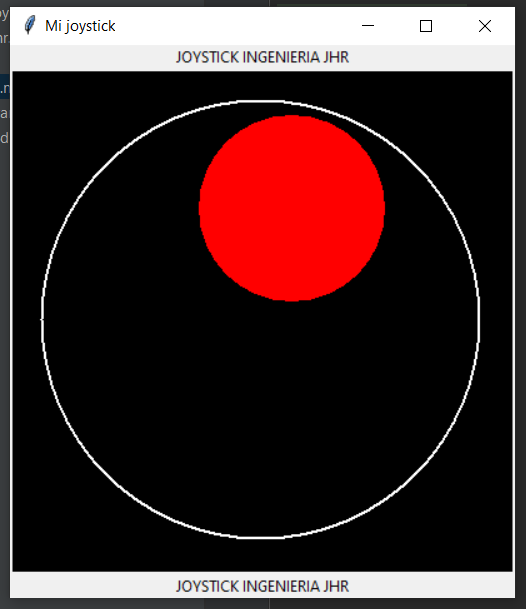

Joystickmultiuso 


instalacion
 ```
pip install joystick-jhr
 ```
importar con python
 ```python
from joystickjhr import joystickJhr as joyjhr
 ```
 
 code main
  ```python
  from joystickjhr import joystickJhr as joyjhr
from tkinter import ttk,Canvas
from tkinter import *
#draw windows
root = Tk()


root.config(width=500, height=500)
root.title("Mi joystick")
#draw label
label = ttk.Label(root, text="JOYSTICK INGENIERIA JHR")
label.pack()

#ancho canvas
widthC = 400
heightC = 400

#ancho joystick
widthJ = 350
heightJ = 350

#posicion joystick
posX = 25
posY = 25
#centro 150+200 = 350 / 2 = 175


joy = joyjhr.JoystickJhr()

canvas = Canvas(root, bg="black", height=heightC, width=widthC)
joy.joy(canvas, widthJ, heightJ, posX, posY,0.4)
joy.movement(canvas)

canvas.pack()

label = ttk.Label(root, text="JOYSTICK INGENIERIA JHR")
label.pack()

while True:
    print(joy.angle_joy())
    root.update_idletasks()
    root.update()
  ```





